**你好，我是 WindsLand，也是星梦**

MaaFramework 生态贡献者 · [📖 我的博客](https://windsland52.github.io)

已在开源社区合入 **235+ PRs · 2000+ commits**，深度参与 MaaFW 框架核心、M9A、MaaLogAnalyzer、MXU 与工具链

## 🚀 社区贡献

| 项目 | 我做了什么 |
| --- | --- |
| [MAA1999/M9A](https://github.com/MAA1999/M9A) `96 PRs · 1.2k+ commits` | 核心开发：StartUp / 深眠 / 肉鸽 / 荒原等核心逻辑多轮重构，肉鸽速刷与战斗识别，轶事派遣、账号切换、兑换码等玩法功能，OCR 升级 PP-OCRv6，Sentry 遥测与趋势分析，CI 与文档体系 |
| [MaaXYZ/MaaFramework](https://github.com/MaaXYZ/MaaFramework) `43 PRs · 50 commits` | 框架本体：Python 绑定补全类型标注并引入 ruff + pyright，schema / interface 多项修订（controller 字段、custom_action_param_code、switch 输入重构），MaaPiCli 兼容修复，Windows VS2026 构建链，文档与术语架构图 |
| [MaaXYZ/MaaLogAnalyzer](https://github.com/MaaXYZ/MaaLogAnalyzer) `5 PRs · 667 commits` | 主要开发者：日志解析器、AI 分析功能、VS Code 插件版布局、新版日志格式适配 |
| [MistEO/MXU](https://github.com/MistEO/MXU) `15 PRs · 15 commits` | MaaFW 桌面 GUI：原生 macOS 控制器支持，任务失败诊断与附件遥测，锁屏 ADB 启动，下载与连接稳定性修复 |
| [neko-para/maa-support-extension](https://github.com/neko-para/maa-support-extension) `5 PRs · 73 commits` | VS Code MaaFW 插件：修复 agent OOM 后任务无法重启，新增 Wayland 合成器支持，日志与诊断体验优化 |
| [MaaEnd/MaaEnd](https://github.com/MaaEnd/MaaEnd) `11 PRs · 23 commits` | JSON Schema 校验 CI、代码格式规范、日常奖励等修复 |
| [MaaXYZ/MFAAvalonia](https://github.com/MaaXYZ/MFAAvalonia) `9 PRs · 14 commits` | 资源更新加固、遥测边界收敛、依赖安装与打包 CI |
| [MaaHub](https://github.com/MaaXYZ/MaaHub) · [MaaFwApp](https://github.com/Aliothmoon/MaaFwApp) · [MAA](https://github.com/MaaAssistantArknights/MaaAssistantArknights) · 等 `30+ PRs · 45+ commits` | maafw-template-migration skill、ABI 收窄、基建修复，以及 MaaPracticeBoilerplate、Stapxs QQ Lite、一图流、MirrorChyan、NapCat Docs 等十余个项目 |

## 🧰 我的项目

| 项目 | 简介 |
| --- | --- |
| [create-maa-project](https://github.com/Windsland52/create-maa-project) ⭐13 | 一条命令开一个 MaaFW 项目：脚手架 CLI + MCP Server，交互式创建与增量维护 Pipeline · Agent 工程 |
| [MaaEvidenceKit](https://github.com/Windsland52/MaaEvidenceKit) ⭐5 | MaaFramework 运行证据提取与诊断工具包：让失败可复现、可定位 |
| [MaaLLMWiki](https://github.com/Windsland52/MaaLLMWiki) ⭐1 | 给 AI 看的 Maa 生态文档目录：机器可读、版本锁定，帮模型定位文档、schema、API 与源码 |
| [MaaTutorial](https://github.com/Windsland52/MaaTutorial) ⭐1 | MaaFramework 入门教程站点（VuePress） |
| [maa-support-sublime](https://github.com/Windsland52/maa-support-sublime) ⭐1 | Sublime Text 的 pipeline 语法支持，已收录进 LSP 上游包索引 |
| [MaaDiagnosticBenchmark](https://github.com/Windsland52/MaaDiagnosticBenchmark) | MaaDiagnosticExpert 的端到端评估套件，检验诊断工作流能否提升模型诊断可靠性 |

## 🎮 游戏自动化

| 项目 | 简介 |
| --- | --- |
| [MST](https://github.com/Windsland52/MST) ⭐11 | 灵魂潮汐日常一键长草，基于 MaaFramework |
| [ArknightsAutoOperator](https://github.com/Windsland52/ArknightsAutoOperator) ⭐8 | 明日方舟帧级打轴机：费用条计时、打轴对轴、循环凹图 |

## 📊 GitHub 数据

  
  

  

